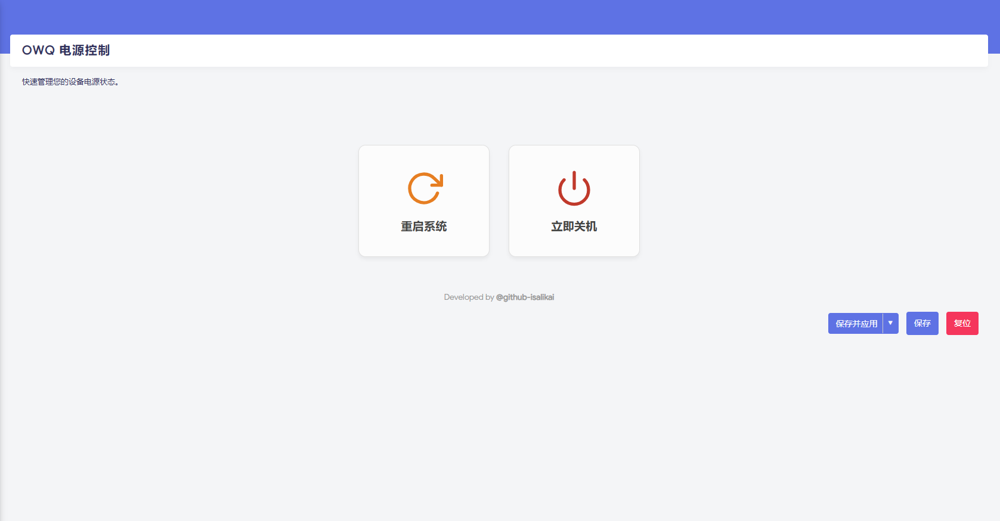

# luci-app-owq-power


**OWQ Power Control** (OpenWrt Quick Power) is a simple, elegant, and safe power management plugin for OpenWrt LuCI.

**OWQ Power Control** 是一个用于 OpenWrt LuCI 的简洁、优雅且安全的电源管理插件。

---

## ✨ Features / 功能特点

* **🛡 Safe & Secure**: Double-confirmation modals prevent accidental shutdowns or reboots.
    * **安全防误触**：提供二次确认弹窗，防止误操作导致关机或重启。
* **🎨 Modern UI**: Card-style layout using Flexbox, distinct from the traditional dull buttons.
    * **现代 UI 设计**：采用卡片式布局，界面简洁美观，区别于传统枯燥的按钮。
* **🌗 Dark Mode Support**: Perfectly adapted to OpenWrt's native dark theme.
    * **深色模式适配**：完美支持 OpenWrt 原生深色主题。
* **🌍 Multi-language**: Supports English and Simplified Chinese (auto-detect).
    * **多语言支持**：支持英文和简体中文（自动识别）。
* **🚀 Architecture Independent**: Pure JavaScript implementation (LuCI-NG), works on x86, ARM, MIPS, etc.
    * **全架构通用**：纯 JS (LuCI-NG) 实现，一个安装包兼容 x86、ARM、MIPS 等所有架构。


## 📸 Screenshots / 截图预览




## 📦 Installation / 安装说明

1. Go to the [Releases Page](../../releases).
   前往 [Releases 页面](../../releases) 下载最新版本。

2. Download the `.ipk` files:
   下载以下两个文件：
   
   * `luci-app-owq-power_x.x.x_all.ipk` (Main App / 主程序)
   * `luci-i18n-owq-power-zh-cn_x.x.x_all.ipk` (Chinese Language Pack / 中文语言包)
   
3. Upload to your router (e.g., `/tmp` folder) and install:
   上传到路由器（如 `/tmp` 目录）并安装：

   ```bash
   cd /tmp
   opkg install luci-app-owq-power*.ipk luci-i18n-owq-power-zh-cn*.ipk

1. Refresh the LuCI page. You will find it under System -> OWQ Power.

   刷新 LuCI 页面，你将在 系统 -> OWQ Power 下找到它。


## ❤️‍🔥Requirements / 系统要求

- **OpenWrt Version**: 23.05 or later (LuCI-NG based).
- **Architecture**: Any (x86_64, aarch64, mips, etc.).


## 💡 Tips: Hide Default Reboot Menu / 技巧：隐藏原生重启菜单

The default "Reboot" menu is part of the core package `luci-mod-system`. **DO NOT uninstall it**, otherwise you will lose critical system settings. 

原生“重启”菜单属于核心包 `luci-mod-system`。**请勿卸载它**，否则你会丢失关键的系统设置功能。

To hide it visually / 如果想从视觉上隐藏它:

1. **Edit the file** / 编辑文件: `/usr/share/luci/menu.d/luci-mod-system.json`
2. **Remove the block** / 删除以下代码块: `"admin/system/reboot": { ... },`
3. **Clear cache** / 清除缓存: `rm -rf /tmp/luci-modulecache/`


## 🤝 Contribution / 贡献

Developed by **[@isalikai](https://github.com/isalikai)**.

Feel free to submit Issues and Pull Requests to improve this project.

欢迎提交 Issue 和 PR 来改进这个项目。


## 📄 License
Licensed under the [GPL v3.0](https://www.gnu.org/licenses/gpl-3.0.html).

